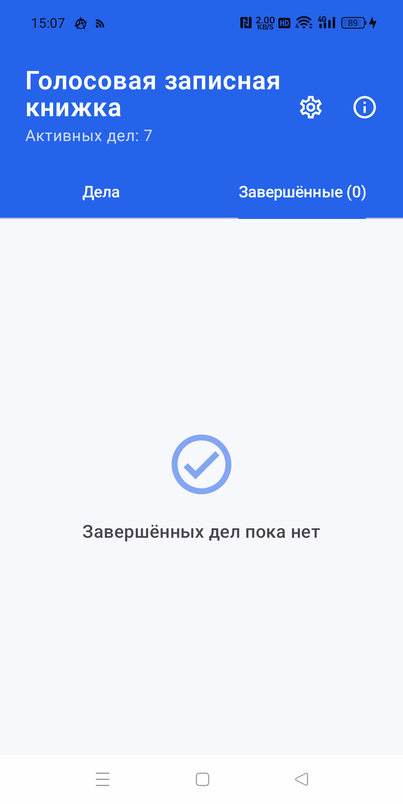
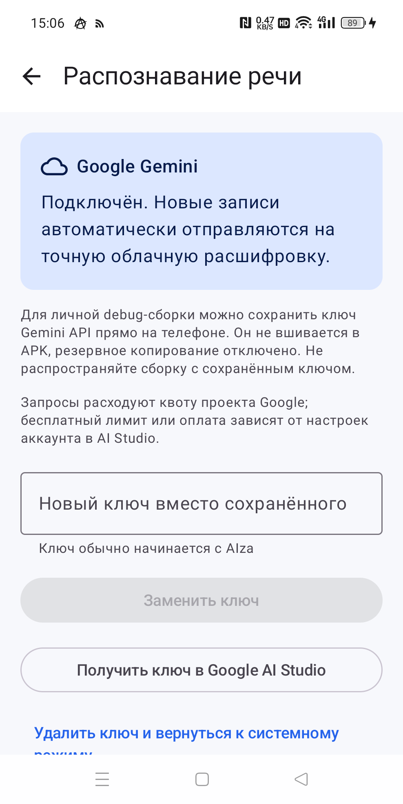
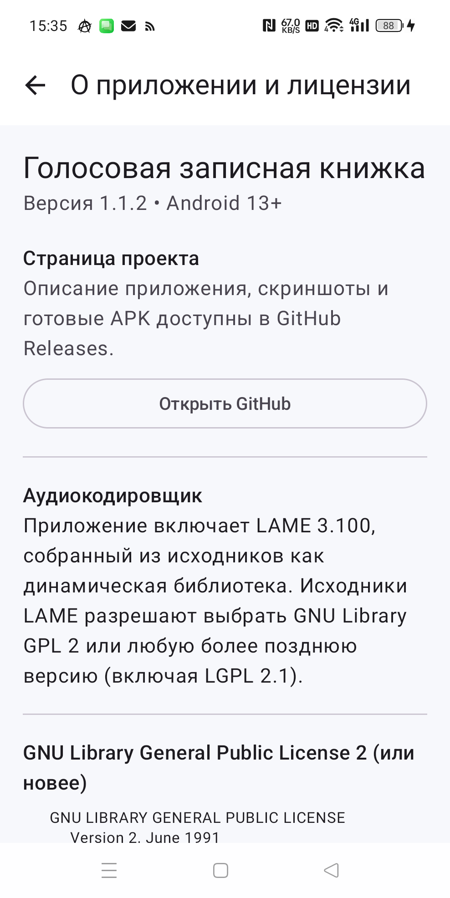

# Голосовая записная книжка

Android-приложение для голосовых дел: произнесите задачу, сохраните её как MP3 и получите текстовую расшифровку. Запись можно прослушать, отредактировать, повторно распознать, завершить, восстановить из архива или удалить.

[Скачать последнюю версию](https://github.com/CyberRSR/voice-organizer-android/releases/latest)

> Требуется Android 13 или новее. Этот репозиторий предназначен для распространения готовых APK; исходный код приложения не публикуется.

## Возможности

- голосовые записи длительностью от 1 до 60 секунд;
- хранение аудио в MP3: mono, 16 кГц, CBR 64 кбит/с;
- русская расшифровка системным распознавателем Android;
- более точное облачное распознавание через Google Gemini по собственному API-ключу;
- повторное распознавание уже сохранённой записи без повторной записи голоса;
- воспроизведение, перемотка и ручное редактирование текста;
- вкладки «Дела» и «Завершённые», восстановление и подтверждённое удаление;
- локальное хранение записей и текста без аккаунта и синхронизации.

## Скриншоты

<table>
  <tr>
    <td align="center"></td>
    <td align="center"></td>
    <td align="center"></td>
  </tr>
  <tr>
    <td align="center">Завершённые дела</td>
    <td align="center">Распознавание речи</td>
    <td align="center">О приложении</td>
  </tr>
</table>

Скриншоты сняты с реального устройства на Android 14. Личные тексты записей в репозиторий не загружались.

## Установка

1. Откройте [последний Release](https://github.com/CyberRSR/voice-organizer-android/releases/latest).
2. В разделе **Assets** скачайте файл с расширением `.apk`.
3. Разрешите установку из выбранного браузера или файлового менеджера, если Android запросит это разрешение.
4. Откройте APK и подтвердите установку.

APK универсальный и содержит библиотеки для `arm64-v8a`, `armeabi-v7a` и `x86_64`. Начиная с v1.1.2 сборки подписываются постоянным release-ключом CyberRSR. SHA-256 сертификата: `E6:5F:4D:2D:22:47:FC:FF:C5:0D:60:8B:EA:65:DB:98:52:3F:79:E3:3F:3A:22:DA:56:96:D0:D5:20:80:B6:EC`.

> Версия v1.1.1-debug была подписана другим, отладочным ключом. Android не установит v1.1.2 поверх неё. Удаление старой debug-версии также удалит локальные записи, поэтому не удаляйте её, пока они нужны. Все новые подписанные версии, начиная с v1.1.2, смогут обновляться поверх друг друга.

## Распознавание через Google Gemini

В настройках приложения можно сохранить собственный Gemini API-ключ. Ключ хранится только в защищённых данных приложения на телефоне, не вшит в APK и не включается в резервное копирование. После подключения новые записи и команда «Распознать заново» используют Gemini; без ключа остаётся системный распознаватель Android.

При облачном распознавании аудио отправляется в сервис Google и расходует квоту соответствующего проекта. Ключ можно удалить в любой момент в настройках приложения.

## Приватность

- MP3 и текст заметок постоянно хранятся во внутреннем каталоге приложения.
- Временный PCM удаляется после успешной обработки.
- При включённом Gemini аудио передаётся Google для расшифровки.
- Системный распознаватель Android также может использовать серверы производителя устройства.

## Сторонние компоненты

Для кодирования MP3 используется динамическая библиотека [LAME 3.100](https://lame.sourceforge.io/), распространяемая на условиях GNU Library GPL 2 или более поздней версии. Полный текст лицензии доступен внутри приложения на экране «О приложении и лицензии», а исходный код LAME 3.100 — на [официальной странице загрузки](https://lame.sourceforge.io/download.php).
